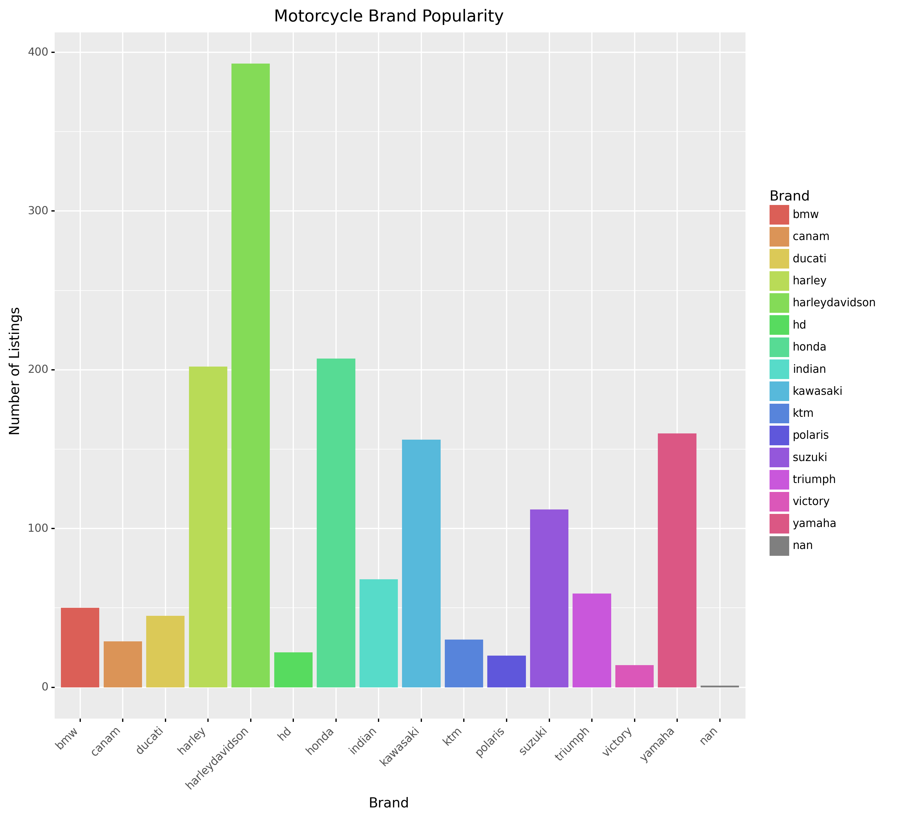
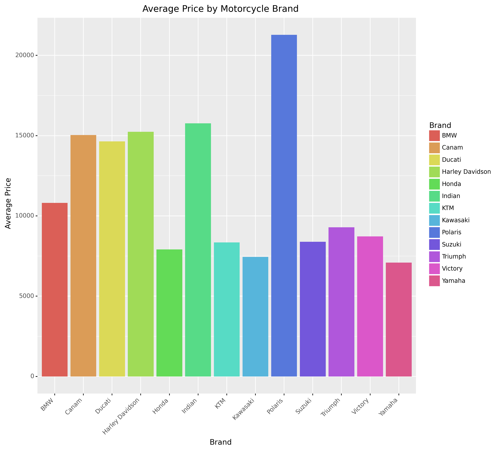
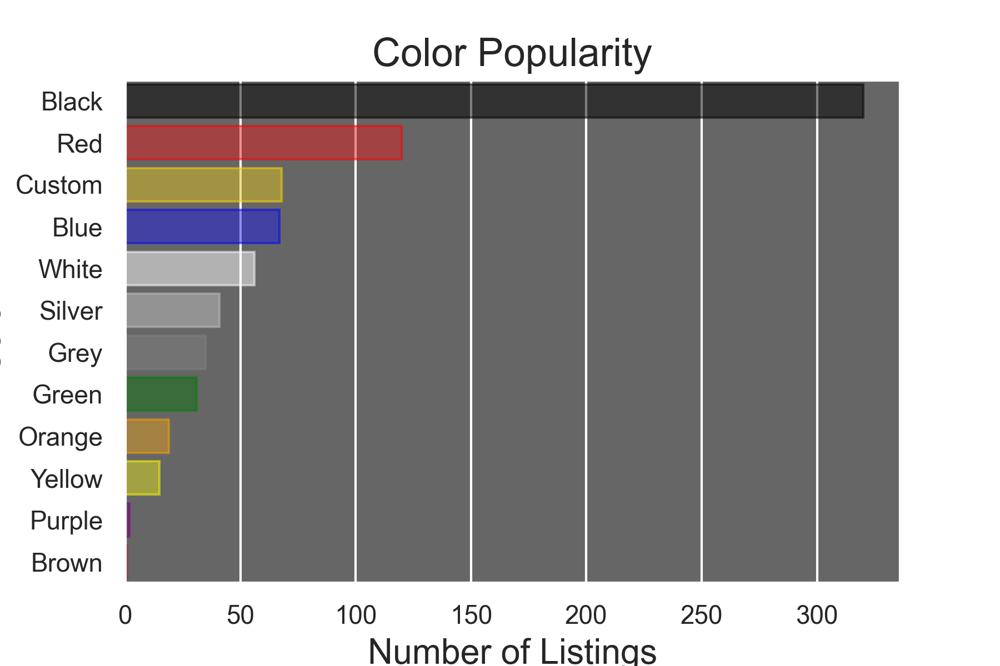
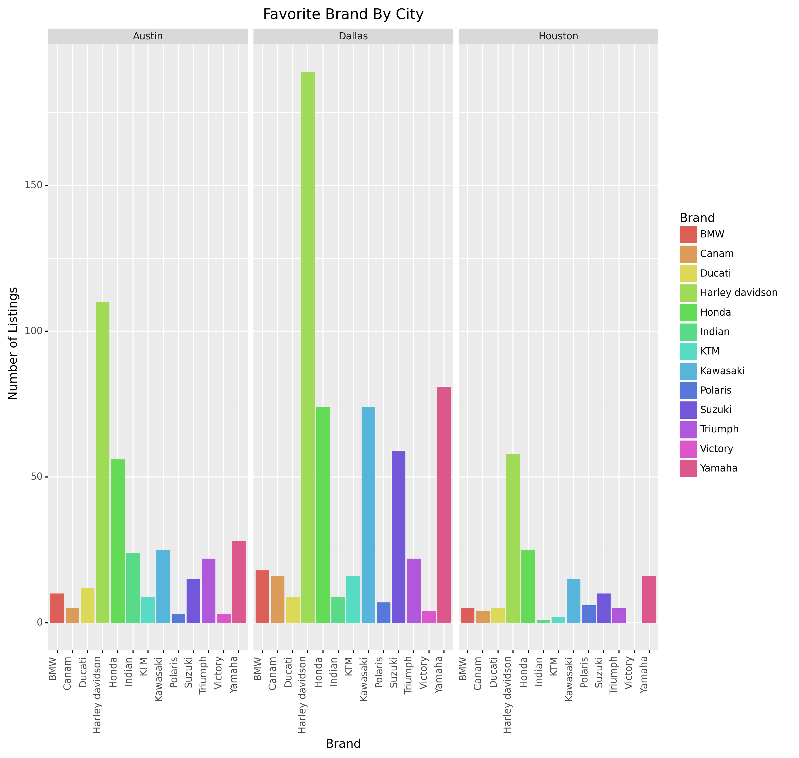

## Report

### Goal
The goal of this project is to learn how to scrape data from Craigslist and to discover interesting trends in Texan's taste for motorcycles.

### Methodology - Data Scraping
Once we decided to use Craigslist to scrape data for motorcycle listings, we used BeautifulSoup to parse html codes of various cities in Texas. This created a data frame of product listings with their respective prices. The script also uses Pandas, os, and request. After this, we used this data frame to extract information for year and brand using the product listing. 

Once we had this data, we used Selenium and product listings to automate search queries; this loops through the product column to find information like color and odometer. We did this to automate the process and export the data to a dataframe rather than manually searching and clicking on each listing in Craigslist. The script also uses pandas and numpy packages.

### Description of project and findings

#### Methodology - Data Visualization

We then made plots to better visualize the scraped data. We wanted to find information about the most popular brands, average price by motorcycle brand, color popularity and favorite motorcycle brand by city. To do this, we used ggplot within plotnine. Additionally, we used matplotlib and seaborn to plot the color popularity data.

Plot 1 shows motorcycle brand popularity across all cities in Texas that were included in the dataset. We can see here that Harley Davidson is the most popular brand at over 600 listings. Honda, Kawasaki and Yamaha are the next most popular and all have around 200 listings.

Plot 2 shows the average price by motorcycle brand across all cities in Texas that were included in the dataset. Polaris has the highest average price at over $20,000. Canam, Ducati, Harley Davidson, and Indian all have the next highest average price of around $15,000. Polaris' price could be skewed high due to the following reasons:

- Polaris bought Indian motorcycles in 2011, but we don't think anyone is misnaming Indian as Polaris in the plots

- Polaris owns Victory

- Polaris doesn't make motorcycles under their own brand, just the car-like slingshots, which could be the reason why the average price is so high

Plot 3 shows the color popularity across all cities in Texas that were included in the dataset and also had a color included in the listing. Black is the most popular color at around 350 listings. Red is the second most popular at around 125 listings.

Plot 4 shows favorite brand by city. We only include cities that had a diversity of listings avaiable, which were Austin, Dallas and Houston. Harley Davidson was the most popular brand in all three cities, which corroborates Plot 1. All three cities follow a similar pattern and distribution, with the exception of Dallas having a higher proportion of Yamaha listings than Austin and Houston do.

#### Limitations
When scraping from Craigslist, we only had the option of choosing from cities, and not states. With doing this, products from nearby cities were included in the scrape, but not included in the search query since these were city specific. This caused us to lose some data. Some other issues were that some data was left blank in the search queries and there were many advertisements (fake listings), which we cleaned. Both of these caused us to lose data for the analysis. When using Selenium, there was a cap on how much you can parse on the product title, so we only parsed with color and odometer. Lastly, when scraping data from Craigslist, the results were dependent on the day, so if we were to do this another day, we would get different results since listings are added, updated or deleted every day.

#### Extensions
Some extensions of this analysis would be scraping data over longer periods of time and expanding the scraping process in different locations and categories in Craigslist. We could scrape over different days, potentially different seasons to see how the information varies. Additionally, we could also scrape in various states across the US and see if the most popular brands, average price by motorcycle brand and color popularity vary by state. Lastly, we could use this same scraping process in different categories on Craigslist. Here we focused on motorcycle product listings, but we could expand this into different automotive listings, such as cars. On a more broad overview, we could expand into different product categories as well.

### Reproducibility
These are the instructions to rerun that analysis.
Order of pacakges to be installed to reproduce the analysis:
1. requests
2. beautifulsoup4
3. plotnine
4. seaborn
5. matplotlib
6. selenium
7. fake-useragent
8. regex

Once these pacakges are installed, the order of running the files is as follows:
1. 
