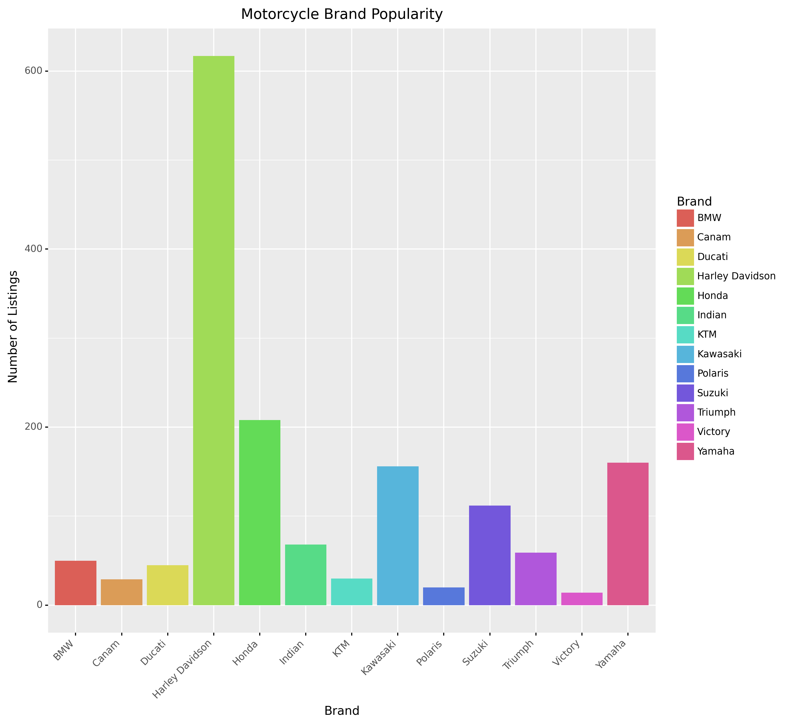

## Report

### Goal
The goal of this project is to learn to scrape data from Craigslist and learn interesting information related to motorcycles.

### Methodology - Data Scraping
Once we decided to use Craigslist to scrape data for motorcycle sales, we decided to use BeautifulSoup to parse html codes of various cities in Texas. This created a data frame of product names and prices. After this, we worked within the data frame to find information for the year it was made and the brand from the product listing name. We did this because the product name had a lot of information about the motorcycle already; most of them had the brand, year, and other pertinent information in the product listing itself. After this, we used Selenium with the product names to automate search queries; this would loop through the product column to find information like color and odometer. We did this to automate the process and get it all on a dataframe instead of manually searching and clicking on each one in Craigslist.
packages: pandas, numpy, matplotlib, seaborn, request

### Description of project and findings

#### Limitations
When scraping from Craigslist, we only had the option of choosing from cities, and not states. With doing this, products from nearby cities were included in the scrape, but not included in the search query since these were city specific. This caused us to lose some data. Additionally, some data was left blank in the search queries. While using Craiglists, there were many advertisements, which we cleaned. The blank data and cleaning the advertisements also caused us to lose data for the analysis.
When using Selenium, there was a cap on how much you can parse on the product title, so we only parsed with color and odometer.

#### Extensions

#### Methodology - Data Visualization

Plot 1 shows motorcycle brand popularity across all cities in Texas that were included in the dataset. We can see here that Harley Davidson is the most popular brand at over 600 listings. Honda, Kawasaki and Yamaha are the next most popular and all have around 200 listings.

Plot 2 shows the average price by motorcycle brand across all cities in Texas that were included in the dataset. Polaris has the highest average price at over $20,000. Canam, Ducati, Harley Davidson, and Indian all have the next highest average price of around $15,000. Polaris' price could be skewed high due to the following reasons:
-Polaris bought Indian motorcycles in 2011, but we don't think anyone is misnaming Indian as Polaris in the plots
-Polaris owns Victory
-Polaris doesn't make motorcycles under their own brand, just the car-like slingshots, which could be the reason why the average price is so high

Plot 3 shows the color popularity across all cities in Texas that were included in the dataset. Black is the most popular color at around 350 listings. Red is the second most popular at around 125 listings.

Plot 4 shows favorite brand by city. The cities of note were Austin, Dallas and Houston. Harley Davidson was the most popular brand in all three cities, which corroborates plot 1. All three cities follow a similar pattern and distribution, with the exception of Dallas having a higher number of listings of Yamaha than Austin and Houston do.

Plot 5 shows average price by motorcycle year across all cities in Texas that were included in the dataset. There was one outlier in 1940 that had a list price of $80,000. All other listings from 1960 to 1990 stayed within the $1,000 to $7,000 range. From 1990 onwards, the listing prices increased and stayed within the $3,000 to $15,000 range.
